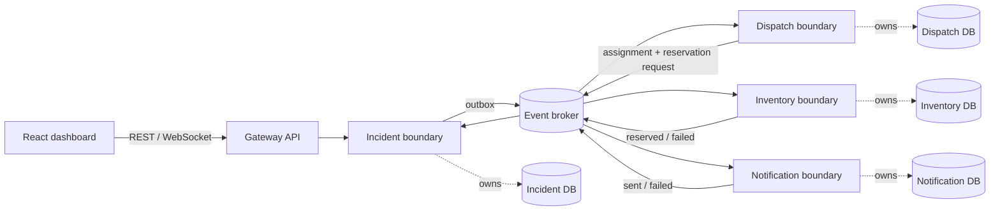

# RescueFlow

RescueFlow is a portfolio-grade, synthetic emergency-response workflow used to demonstrate event-driven coordination and failure handling. It is **not** a medical product, does not use real people or incidents, and makes no production-readiness or regulatory claim.

The runnable vertical slice accepts an incident, validates it, deterministically chooses a capable responder, reserves a resource, simulates a notification, and marks the incident assigned. Every step uses a versioned event envelope and an outbox relay. The default executable uses concurrency-safe local adapters so contributors can run unit and HTTP tests without infrastructure; Docker Compose provisions the target PostgreSQL-per-service, Kafka KRaft, Redis, Prometheus, Grafana, Tempo, Loki, and web environment. Persistent PostgreSQL/Kafka/Redis runtime adapters remain an explicitly tracked gap—see [Known limitations](docs/known-limitations.md).

## Architecture



Service boundaries do not share domain tables. The local adapter mirrors those ownership lines in isolated maps; the SQL migrations create four independent databases. Incident events are keyed by incident ID in the target Kafka topology so related messages retain partition ordering.

## Reliability guarantees

- Business changes and their outbox record are created under one store lock locally and one database transaction in the documented PostgreSQL design.
- Consumers record `(consumer_name, event_id)` and acknowledge only after their handler succeeds. Duplicate event IDs are no-ops.
- Handlers receive at most three attempts with 1 ms / 2 ms exponential delays in tests; deployed values should be seconds plus jitter. Exhausted events preserve the envelope and failure metadata in the dead-letter collection.
- A successful DLQ hand-off is marked processed, preventing poison-message loops. Replay clears that consumer marker before redelivery.
- Resource reservation compares an expected version while holding the atomic update boundary. A race between two callers has exactly one winner.
- Resource failure cancels the assignment and makes the incident unassigned. Responder rejection releases its reservation, cancels the assignment, and starts a deterministic reassignment. Notification failure never rolls back an otherwise valid assignment.
- Redis is never the durable source of truth; losing it can affect only cache/ephemeral state in the target architecture.

## Quick start

Prerequisites: Docker with Compose. The repository pins Go 1.27.1 in its build image and exact frontend packages in `package-lock.json`.

```bash
cp .env.example .env
make up
```

Open the dashboard at <http://localhost:3000>, API at <http://localhost:8080>, Grafana at <http://localhost:3001>, and Prometheus at <http://localhost:9090>.

Without Docker, run the dependency-free backend with Go:

```bash
go run ./cmd/rescueflow
```

Create a synthetic incident:

```bash
curl -X POST http://localhost:8080/api/v1/incidents \
  -H 'Content-Type: application/json' \
  -H 'Idempotency-Key: demo-001' \
  -d '{"incident_type":"medical","severity":4,"latitude":47.6062,"longitude":-122.3321,"description":"Synthetic drill"}'
```

## Development commands

```text
make setup             install frontend dependencies
make up                build and start the local stack
make test              run backend race tests and frontend tests
make validate          vet, compile the UI, render Kubernetes manifests
make load-test         run the k6 scenario (results are not committed)
make down              stop the stack without deleting volumes
```

API and event contracts are in [OpenAPI](docs/api/openapi.yaml) and [AsyncAPI](docs/events/asyncapi.yaml). Operational procedures live in [the runbook](docs/runbooks/operations.md), and implementation truth is tracked in [PROGRESS.md](PROGRESS.md).

## Important dependencies

| Dependency | Purpose | Choice |
|---|---|---|
| Go standard library | HTTP, WebSockets, concurrency, crypto IDs | Keeps the verified local core dependency-free |
| Apache Kafka 4.2 | Target durable event transport | Official image, KRaft mode, no ZooKeeper |
| PostgreSQL 17 | Target durable state and outbox | Separate databases and migrations per service |
| Redis 7.4 | Ephemeral cache only | Durable correctness never depends on it |
| React 19.2 / Vite 8.2 / TypeScript 7 | Dashboard | Exact versions locked; zero known audit findings at verification time |
| Prometheus / Grafana / Tempo / Loki | Metrics, dashboards, traces, logs | Practical open-source local stack |

## Repository map

- `cmd/rescueflow`: runnable composition root
- `internal/domain`: state machines and owned entities
- `internal/events`: event envelope and catalog constants
- `internal/platform`: broker, outbox, stores, saga handlers, and live-update hub
- `internal/api`: gateway REST and WebSocket API
- `services`: ownership notes for the five intended deployable boundaries
- `infra`: Compose support, SQL, monitoring, and Kubernetes
- `tests/load`: k6 scenario
- `docs`: decisions, contracts, architecture, and operations

