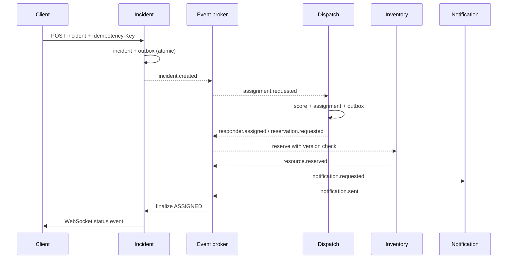

# Architecture overview

RescueFlow uses choreography for the ordinary workflow and explicit compensation events when local commitments must be undone. Each boundary owns its state and never reaches into another service database. REST is for external commands and queries; events are the source of cross-service workflow progress. A future gRPC read endpoint may be justified for dispatch-to-inventory capability discovery, but it is intentionally not added until the persistent service split exists.

## Ownership

| Boundary | Durable entities | Publishes | Consumes |
|---|---|---|---|
| Incident | incidents, status history, idempotency keys, outbox | incident.created, incident.status.updated, assignment.requested | notification.sent, compensation outcomes |
| Dispatch | responders, assignments, processed IDs, outbox | responder.assigned/rejected, reservation.requested, assignment.cancelled | assignment.requested, reservation.failed |
| Inventory | resources, reservations, processed IDs, outbox | resource.reserved/failed/released | reservation.requested, responder.rejected, assignment timeout |
| Notification | attempts, successful sends, processed IDs | notification.sent/failed | notification.requested |
| Gateway | no authoritative workflow state | correlation-aware commands | live events for WebSocket fan-out |

## Deterministic dispatch score

Candidates must be available and contain the required capability (`medical`, `fire`, or `rescue`). Score is `100 - 2 × distance_km - 15 × current_workload`. Highest score wins; responder ID is the deterministic tie-breaker. This is transparent and testable—no machine learning is involved.

## Ordering and delivery

The target Kafka producer uses `incident_id` as the record key. Kafka therefore orders an incident's events within one partition, not globally. Delivery is at least once. Consumers commit offsets only after their database transaction (business mutation, processed-event insert, and any outbox inserts) commits. Idempotency makes duplicates harmless. A crash after database commit and before offset commit causes safe replay.

